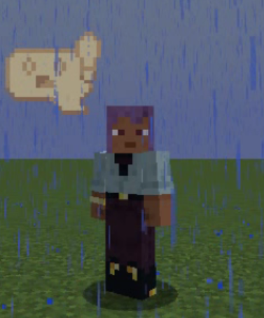

# FacePop —— 快捷表情气泡

FacePop 是一款基于 Minecraft Forge 开发的 Mod。

## 简介



按 `G` 键打开本 mod 主界面，按 `Ctrl + G` 打开表情设置界面。

FacePop 如很多 Mod 一样，提供了数据包进行自定义，并拥有最基本的管理系统。

表情管理系统中，基本单位为**表情包**（facebag）。

表情包自定义中有一个属性，`default_unlock`，该属性指示了默认情况下是否解锁。

另外，该 Mod 还拥有指令为指定玩家解锁表情包：

`/facepop unlock [player] [facebag]`

以及针对指令使用者的：

`/facepop unlock [facebag]`

## 数据包格式说明

### Face

```json5
{
  "id": "[ResourceLocation]", // 必选，指定唯一的 ID，用以查找对应表情
  "image_path": "[ResourceLocation]]", // 必选，指定表情所在位置
  "language_key": "[String]",  // 可选，指定语言键，默认 [namespace].[path] （WIP）
  "offset_x" : 0, // 可选，默认 0，表情相对玩家头顶的 X 方向的偏移
  "offset_y": 0 // 可选，默认 0，表情相对玩家头顶的 Y 方向的偏移
}
```

### FaceBag

```json5
{
  "id": "[ResourceLocation]",  // 必选，指定唯一的 ID，用于权限控制
  "faces": [{ // 必选，指定该表情包中有哪些表情
    /* Face */
  }],
  "icon": "[ResourceLocation]",  // 必选，指定设置界面表情包的 icon
  "default_unlock": false, // 可选，默认 false，指定该表情包是否默认解锁
  "lock_message": "facebag.lock"  // 可选，默认 facebag.lock，指定解锁前的提示信息 （WIP）
}
```
